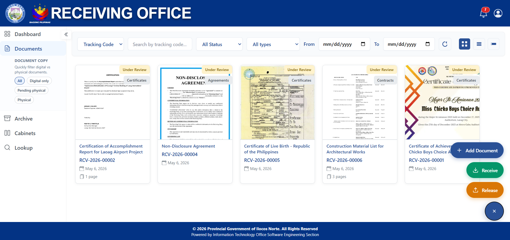
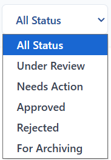
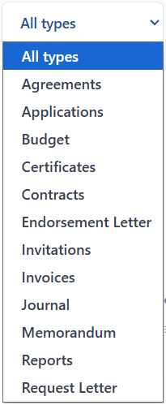
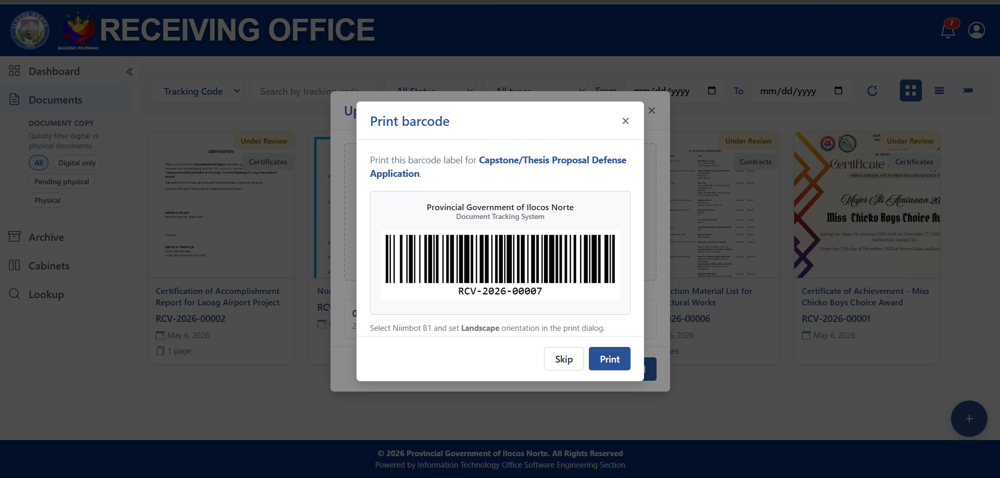
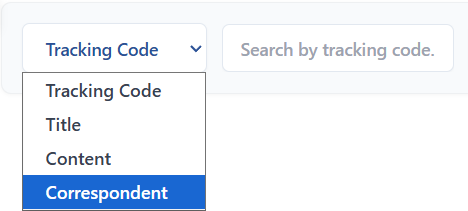
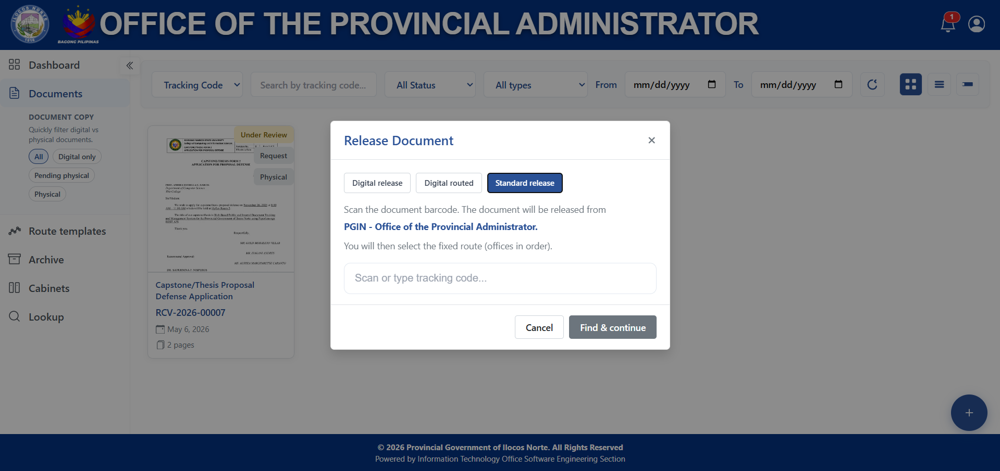
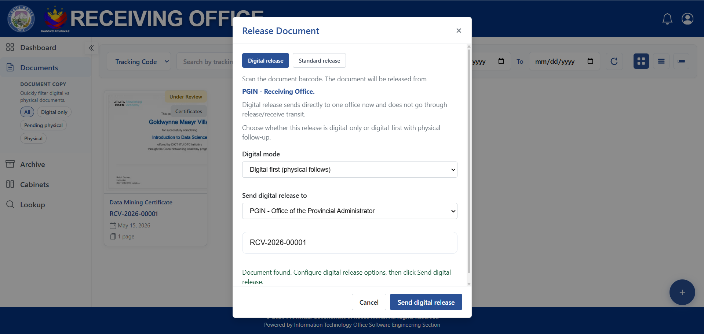
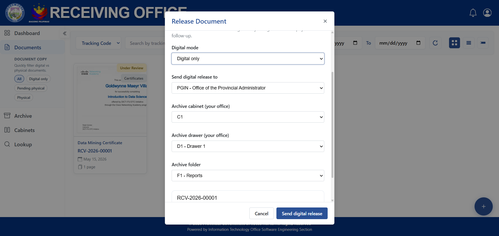

# Document Tracking and Management System X PaperlessNGX

A modern document tracking and management system, designed for the PGIN.

## Public Tracker

  
  
  
  

  Public tracking interface of the Document Tracking Management System.

## Offices Main Interface

  

  Main office interface, where a multi + modal is used to add, receive, and
release

## Document AI Suggestions

  

  The system will suggest the Document Title, Document Info and Submitted by, which
are also editable and selectable, in case OCR fails to read the document.

## Document Filters

  
  

  Documents can be filtered out by Document Status and Document Types.

## Document Barcode

  

The system can generate a printable barcode, which can then be stamped to the
physical document.

## Document Search

  

  Documents can be searched using their tracking Code, title, document content and correspondent.

## Document Release Types

  

  Standard release, with the use of the barcode for receiving and releasing.

  

   Digital First, meaning the digital document will be sent to the
Office selected and physical copy will still follow.

  

  Digital Only, meaning the digital document will be sent to
the Office selected and the document will be then be archived to the office who released it

